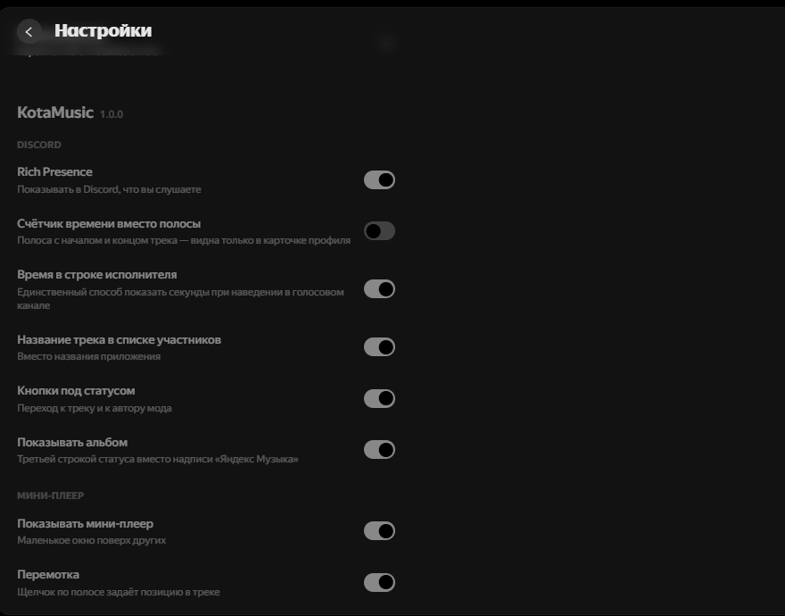

<div align="center">

# KotaMusic

**Модификация настольного клиента [Яндекс Музыки](https://music.yandex.ru/download/)**

Discord Rich Presence, мини-плеер, горячие клавиши и другие мелочи,
которых не хватает обычному клиенту.

[](https://discord.com/invite/XYBvdvfv8t)
[](README.md)
[](docs/en/README.md)

### Скачать установщик

[](https://github.com/AveHarrisan/KotaMusic/releases/download/installer/KotaMusic-Setup.exe)
[](https://github.com/AveHarrisan/KotaMusic/releases/download/installer/KotaMusic.AppImage)
[-777777?style=for-the-badge&logo=apple&logoColor=white)](https://github.com/AveHarrisan/KotaMusic/releases/download/installer/KotaMusic.dmg)

[](https://github.com/AveHarrisan/KotaMusic/releases)
[](https://github.com/AveHarrisan/KotaMusic/releases/latest)
[](https://github.com/AveHarrisan/KotaMusic/releases)

</div>

> [!IMPORTANT]
> Мод **не заменяет подписку Яндекс Плюс** и не снимает защиту с треков.
> Нужен официальный клиент и действующая подписка.

---

## Установка

1. Скачайте установщик: **[Windows](https://github.com/AveHarrisan/KotaMusic/releases/download/installer/KotaMusic-Setup.exe)** ·
   [Linux](https://github.com/AveHarrisan/KotaMusic/releases/download/installer/KotaMusic.AppImage) ·
   [macOS](https://github.com/AveHarrisan/KotaMusic/releases/download/installer/KotaMusic.dmg)
2. Закройте Яндекс Музыку и запустите установщик
3. Нажмите «Установить мод» и дождитесь окончания

Официального клиента у вас может и не быть: установщик сам предложит его
поставить — адрес свежей версии он берёт у Яндекса.

Настройки мода появятся внутри клиента: **Настройки → KotaMusic**.

### Обновления

Дальше установщик не нужен: мод обновляет себя сам.

- Вышла новая версия мода — сообщение в клиенте и кнопка «Обновить
  и перезапустить».
- Вышла новая Яндекс Музыка, сборка мода под неё готова — «Обновить клиент
  и мод»: ставится официальный клиент, поверх — мод, клиент перезапускается.
- Вышла новая Яндекс Музыка, а сборки ещё нет — клиент придерживается на
  прежней версии, чтобы мод не слетел. Автосборка выпускает мод в течение
  трёх часов.

Придерживание отключается тумблером «Обновлять клиент вместе с модом».

Что именно изменилось, видно прямо в сообщении об обновлении, а целиком —
в [CHANGELOG.md](CHANGELOG.md) и в описании релиза.

<details>
<summary>Удалить мод</summary>

Откройте установщик и нажмите «Удалить мод» — оригинальный клиент вернётся
из резервной копии, сделанной при установке. Переустанавливать Яндекс Музыку
не нужно.

</details>

<details>
<summary>Установить вручную, без установщика</summary>

В каждом релизе лежит файл `app.asar`. Его нужно положить в папку клиента,
заменив такой же:

- **Windows** — `%localappdata%\Programs\YandexMusic\resources\`
- **Linux** — `/opt/Яндекс Музыка/resources/`

На Windows этого мало: клиент проверяет целостность файла, и после подмены
он откажется запускаться. Установщик правит эту проверку сам, поэтому
вручную ставить стоит только на Linux.

</details>

---

## Возможности

### Discord Rich Presence

<details open>
<summary>Что показывает</summary>

Название трека, исполнителей, альбом и обложку. Время идёт полосой в карточке
профиля или счётчиком — на выбор. Название и исполнитель кликаются, под
статусом две кнопки.

Работает и в обычном режиме, и в «Моей волне».

</details>

### Мини-плеер

<details open>
<summary>Как выглядит</summary>


Отдельное окно поверх остальных: обложка, название, перемотка щелчком по
полосе, громкость по кнопке с процентом. Каждый элемент можно убрать.

Окно умеет прятаться, пока играть нечего: в настройках есть «Прятать,
когда ничего не играет». Тогда вместо надписи «Ничего не играет» на
экране не остаётся ничего, а с первым треком окно возвращается на своё
место. Пауза окно не убирает — трек ведь никуда не делся.

</details>

### Горячие клавиши

<details>
<summary>Какие и как менять</summary>

Работают поверх других окон — из игры, браузера, откуда угодно.

| Действие | По умолчанию |
| --- | --- |
| Пауза и воспроизведение | `Ctrl+Alt+Пробел` |
| Следующий трек | `Ctrl+Alt+→` |
| Предыдущий трек | `Ctrl+Alt+←` |
| Громче / тише | `Ctrl+Alt+↑` / `Ctrl+Alt+↓` |
| Лайк | `Ctrl+Alt+L` |
| Показать мини-плеер | не задано |

Любое сочетание меняется в настройках: нажмите поле и задайте своё.
`Backspace` убирает клавишу, «Вернуть по умолчанию» возвращает весь набор.


</details>

### Остальное

<details>
<summary>Список</summary>

- **Кнопки на панели задач Windows** — управление из миниатюры окна,
  не разворачивая клиент
- **Процент громкости** — подсказка рядом с ползунком при изменении
- **Управление другими устройствами** — с компьютера можно управлять
  телефоном и колонкой
- **Масштаб интерфейса** — от 50 до 200 процентов
- **Не гасить экран во время музыки**

</details>

---

## Настройки

Всё управляется прямо в клиенте, изменения применяются сразу.



---

## Как это устроено

Репозиторий содержит только наш код: слой мода и описания врезок в клиент.
Кода Яндекса здесь нет — сборка скачивает официальный установщик, достаёт
из него `app.asar`, накладывает патчи и пакует обратно.

Сборки выходят автоматически: раз в три часа проверяется версия клиента,
и на новую собирается свежий мод. Если врезка не легла — сборка падает,
заводится задача, а сломанный релиз не публикуется.

<details>
<summary>Собрать самому</summary>

```bash
npm install
node scripts/build.js --platform=win32   # win32 | linux | darwin
```

Результат — `dist/app.asar` и `dist/build-info.json` с версией клиента
и отчётом по врезкам. Для распаковки установщиков нужны `ar` и `tar`
на Linux, `7z` для Windows и macOS.

Установить собранное в клиент:

```bash
node scripts/install-local.js --client="/путь/к/клиенту"
node scripts/install-local.js --client="/путь/к/клиенту" --restore
```

</details>

<details>
<summary>Структура</summary>

```
mod/        код мода, попадает в app.asar отдельной папкой
patches/    врезки в код клиента; каждая сообщает, что не применилась
scripts/    сборка и работа с официальной раздачей клиента
installer/  установщик с окном
docs/       план работ и картинки
```

</details>

---

## Что дальше

Планы и то, что уже сделано — в [docs/ROADMAP.md](docs/ROADMAP.md).
Нашли ошибку или хотите функцию — [заведите задачу](https://github.com/AveHarrisan/KotaMusic/issues).

## Вопросы и общение

Сервер в Discord — **[discord.com/invite/XYBvdvfv8t](https://discord.com/invite/XYBvdvfv8t)**.
Там же можно рассказать об ошибке, если не хочется заводить задачу.

Мод продолжает идею закрытого проекта **YandexMusicModClient**: тот же круг
возможностей, но своя реализация и автоматические сборки под свежие версии
клиента.

## Поддержать

Проект делается в свободное время. Если он вам пригодился:

- **[Boosty](https://boosty.to/aveharrisan)** — разовая или регулярная поддержка
- **[DonationAlerts](https://www.donationalerts.com/r/aveharrisan)** — разовый донат

Кнопка «Sponsor» в правой колонке репозитория ведёт туда же.
