<div align="center">

# KotaMusic

**Модификация настольного клиента [Яндекс Музыки](https://music.yandex.ru/download/)**

Discord Rich Presence, мини-плеер, горячие клавиши и другие мелочи,
которых не хватает обычному клиенту.

[](https://discord.com/invite/XYBvdvfv8t)
[](https://lvl.su/)
[](https://t.me/kotamarine)
[](https://t.me/aveharrisan)
[](README.md)
[](docs/en/README.md)

### Скачать установщик

[](https://github.com/AveHarrisan/KotaMusic/releases/download/installer/KotaMusic-Setup.exe)
[](https://github.com/AveHarrisan/KotaMusic/releases/download/installer/KotaMusic.AppImage)
[-777777?style=for-the-badge&logo=apple&logoColor=white)](https://github.com/AveHarrisan/KotaMusic/releases/download/installer/KotaMusic.dmg)

[](https://github.com/AveHarrisan/KotaMusic/releases)
[](https://github.com/AveHarrisan/KotaMusic/releases)
[](https://github.com/AveHarrisan/KotaMusic/releases)

### Поддержать и найти меня

Проект делается в свободное время. Если он вам пригодился:

<table>
<tr>
<td align="center" width="120">
<a href="https://boosty.to/aveharrisan">
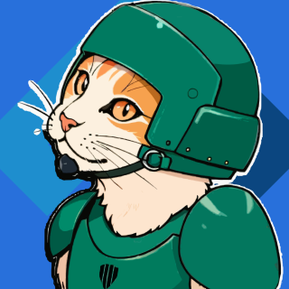<br>
<b>Boosty</b>
</a><br>
<sub>разово или подпиской</sub>
</td>
<td align="center" width="120">
<a href="https://www.donationalerts.com/r/aveharrisan">
<br>
<b>DonationAlerts</b>
</a><br>
<sub>разовый донат<br>без подписки</sub>
</td>
<td align="center" width="120">
<a href="https://lvl.su/">
<br>
<b>lvl.su</b>
</a><br>
<sub>гайды и вики</sub>
</td>
<td align="center" width="120">
<a href="https://t.me/kotamarine">
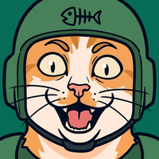<br>
<b>Котамарин</b>
</a><br>
<sub>канал про игры<br>и раздачи</sub>
</td>
<td align="center" width="120">
<a href="https://discord.com/invite/XYBvdvfv8t">
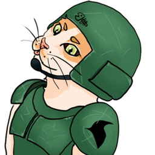<br>
<b>Discord</b>
</a><br>
<sub>вопросы и ошибки</sub>
</td>
<td align="center" width="120">
<a href="https://t.me/aveharrisan">
<br>
<b>AveHarrisan</b>
</a><br>
<sub>телеграм<br>автора</sub>
</td>
</tr>
</table>

</div>

> [!IMPORTANT]
> Мод **не заменяет подписку Яндекс Плюс** и не снимает защиту с треков.
> Нужен официальный клиент и действующая подписка.

---

## Установка

1. Скачайте установщик: **[Windows](https://github.com/AveHarrisan/KotaMusic/releases/download/installer/KotaMusic-Setup.exe)** ·
   [Linux](https://github.com/AveHarrisan/KotaMusic/releases/download/installer/KotaMusic.AppImage) ·
   [macOS](https://github.com/AveHarrisan/KotaMusic/releases/download/installer/KotaMusic.dmg)
2. Закройте Яндекс Музыку и запустите установщик
3. Нажмите «Установить мод» и дождитесь окончания

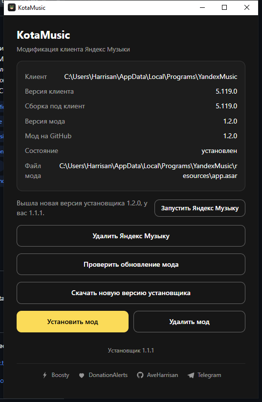

Установщик показывает, где нашёлся клиент, какая версия мода стоит и какая
выложена на GitHub. Кнопка «Проверить обновление мода» сверяет их, а при
обновлении он сам закрывает Яндекс Музыку и открывает её обратно.

Официального клиента у вас может и не быть: установщик сам предложит его
поставить — адрес свежей версии он берёт у Яндекса.

Настройки мода появятся внутри клиента: **Настройки → KotaMusic**.

### Обновления

Дальше установщик не нужен: мод обновляет себя сам.

- Вышла новая версия мода — сообщение в клиенте и кнопка «Обновить
  и перезапустить».
- Вышла новая Яндекс Музыка, сборка мода под неё готова — «Обновить клиент
  и мод»: ставится официальный клиент, поверх — мод, клиент перезапускается.
- Вышла новая Яндекс Музыка, а сборки ещё нет — клиент придерживается на
  прежней версии, чтобы мод не слетел. Автосборка выпускает мод в течение
  трёх часов.

Придерживание отключается тумблером «Обновлять клиент вместе с модом».

Что именно изменилось, видно прямо в сообщении об обновлении, а целиком —
в [CHANGELOG.md](CHANGELOG.md) и в описании релиза.

<details>
<summary>Удалить мод</summary>

Откройте установщик и нажмите «Удалить мод» — оригинальный клиент вернётся
из резервной копии, сделанной при установке. Переустанавливать Яндекс Музыку
не нужно.

</details>

<details>
<summary>Установить вручную, без установщика</summary>

В каждом релизе лежит файл `app.asar`. Его нужно положить в папку клиента,
заменив такой же:

- **Windows** — `%localappdata%\Programs\YandexMusic\resources\`
- **Linux** — `/opt/Яндекс Музыка/resources/`

На Windows этого мало: клиент проверяет целостность файла, и после подмены
он откажется запускаться. Установщик правит эту проверку сам, поэтому
вручную ставить стоит только на Linux.

</details>

---

## Возможности

### Discord Rich Presence

<details open>
<summary>Что видят в профиле</summary>

Название трека, исполнителей, альбом и обложку. Название и исполнитель
кликаются — ведут на страницу трека и артиста на сайте Яндекс Музыки.

- **Время** — полосой в карточке профиля или счётчиком «♪ 0:24». Счётчик
  виден ещё и в карточке голосового канала, полоса — только в профиле.
- **Время в строке исполнителя** — единственный способ показать секунды
  при наведении в голосовом канале.
- **Название трека в списке участников** вместо названия приложения.
- **Кнопки под статусом** — переход к треку и к автору мода.
- **Свой Discord** — статус собирает сам мод, без сторонних библиотек,
  и восстанавливает связь, если Discord перезапустили.

Работает и в обычном режиме, и в «Моей волне». На паузе статус
снимается через пару секунд, а при смене трека не пропадает.

<p>
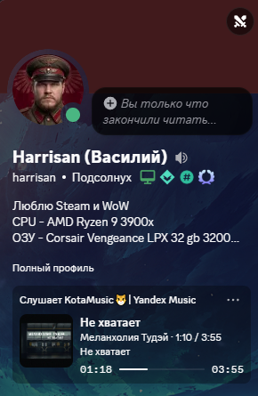
&nbsp;
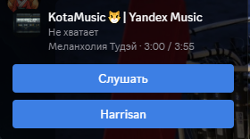
</p>

</details>

### Скачивание треков в файл

<details open>
<summary>Трек, альбом или плейлист обычным файлом</summary>

Кнопка со стрелкой в панели плеера скачивает то, что играет. В меню
трека, альбома и плейлиста появляется пункт **«Скачать в файл»**.

- **Настоящий формат** — Яндекс отдаёт FLAC внутри контейнера MP4,
  мод достаёт из него звук и сохраняет обычный `.flac`. Можно попросить
  MP3: тогда мод берёт у Яндекса готовый MP3, ничего не перекодируя.
- **Обложка и подписи в самом файле** — название, исполнитель, альбом,
  год, жанр и номер трека.
- **Текст песни** — рядом ложится файл `.lrc` с синхронным текстом.
- **Куда складывать** — при первом скачивании мод спросит папку и
  запомнит её; поменять можно в настройках. Альбом и плейлист кладутся в папку со своим
  названием, но можно попросить складывать всё в одну общую.
- **«Текст песни» и «Открыть папку со скачанным»** — соседними пунктами
  в том же меню.
- **Уже скачанное не качается дважды** — мод покажет, когда файл был
  создан, и спросит, скачивать ли заново. В альбоме такие треки
  пропускаются.
- **Спрашивать каждый раз** — по желанию мод перед скачиванием
  предлагает выбрать: в общую папку, в папку альбома или в другую.
- **Ход дела** — полоска с числом треков и скоростью; альбом качается
  в три потока.

Ничего обходить не приходится: мод просит файл тем же способом, что и
сам клиент, от имени того же человека. Без подписки Яндекс ссылку
не даёт.

</details>

### Качество трека

В углу, рядом с кнопками мода, стоит подпись с тем, что именно играет:
`HQ+: FLAC`. Видна на любой странице, включая «Мою волну». Нажатие
открывает настройки звука клиента.

### Текст песни

Своя панель с текстом: строка подсвечивается по времени. Сначала мод
спрашивает текст у Яндекса, а если там пусто — в открытой базе
[LRCLib](https://lrclib.net). Так текст находится и для треков, которых
у Яндекса нет. Открывается кнопкой в панели плеера или пунктом «Текст
песни» в меню. Справа вверху панели видно, откуда взят текст.

Панель можно перетащить за заголовок, растянуть за угол и развернуть
во весь экран — тогда текст идёт по центру и крупнее. Кнопка «⟲»
возвращает исходные размер и место. Размер шрифта выбирается
в настройках.

<p>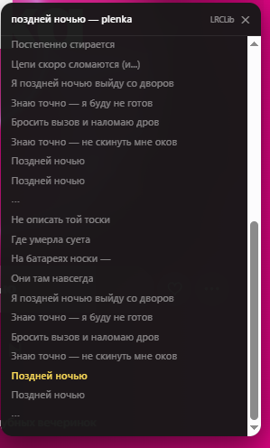</p>

### Память и кеш

Данные клиента (кеш и скачанное в самом клиенте) можно перенести на
другой диск: мод задаёт папку до запуска клиента и переносит в неё всё,
кроме настроек и журналов. Там же видно, сколько треков скачано в клиенте
и сколько это занимает.

### Мини-плеер

<details open>
<summary>Отдельное окно поверх остальных</summary>

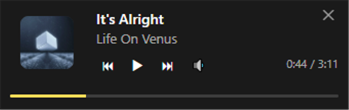

Обложка, название бегущей строкой, исполнитель, время и полоса. Управление:
пауза, следующий и предыдущий трек, громкость по кнопке с процентом,
перемотка щелчком по полосе.

- **Компактный вид** — окно ниже и уже, исполнитель уходит в строку
  названия.
- **Прятать, когда ничего не играет** — окно исчезает вместо надписи
  «Ничего не играет» и возвращается с первым треком. Пауза окно не убирает.
- **Фиксация** — окно становится полупрозрачным и перестаёт ловить мышь:
  на него можно только смотреть. Снимается горячей клавишей на заданное
  число секунд.
- **Свой размер** — окно можно тянуть за край, размер запоминается.
- **Место** запоминается само; при желании окно показывается в панели
  задач.
- **Кнопка вызова** — в правом нижнем углу клиента, рядом с версией.

</details>

### Плашка для трансляции

<details open>
<summary>«Сейчас играет» для OBS</summary>

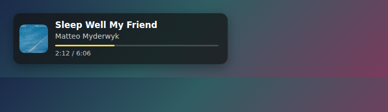

Мод поднимает страницу по адресу `http://127.0.0.1:8462/` — её добавляют
в OBS источником «Браузер». Адрес слушается только на своей машине, из
сети плашка не видна. Обложку отдаёт сам мод, поэтому она появляется
даже там, где нет доступа к серверам Яндекса.

Настраивается почти всё:

| Что | Варианты |
| --- | --- |
| Подложка | тёмная, светлая или прозрачная — только текст с обводкой |
| Обложка | показывать или нет, размер от 32 до 160 пикселей |
| Полоса времени | показывать или нет, свой цвет |
| Время числами | строка «2:12 / 6:06» под полосой |
| Цвета текста | свои для названия, исполнителя и времени, с кнопкой сброса |
| Размер текста | от 10 до 48 пикселей |
| Ширина | постоянная: от длины названия не пляшет, длинное едет строкой |

Изменения видны сразу — источник в OBS перезагружать не нужно. Рядом
с настройками есть предпросмотр: видно, как плашка будет выглядеть
в кадре, не открывая её в браузере.

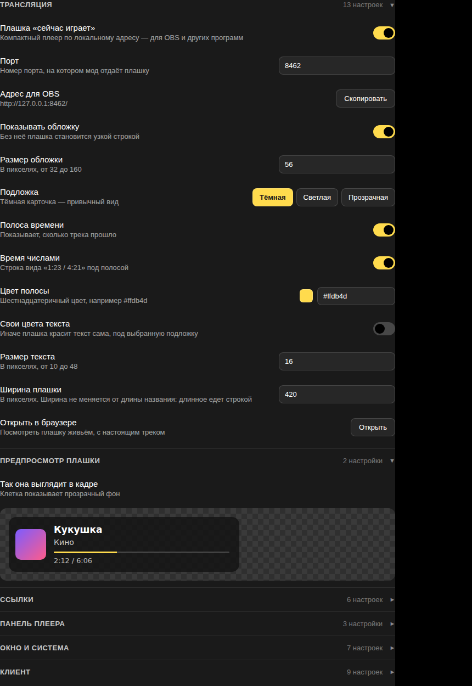

</details>

### Окно и система

<details open>
<summary>Как ведёт себя клиент</summary>

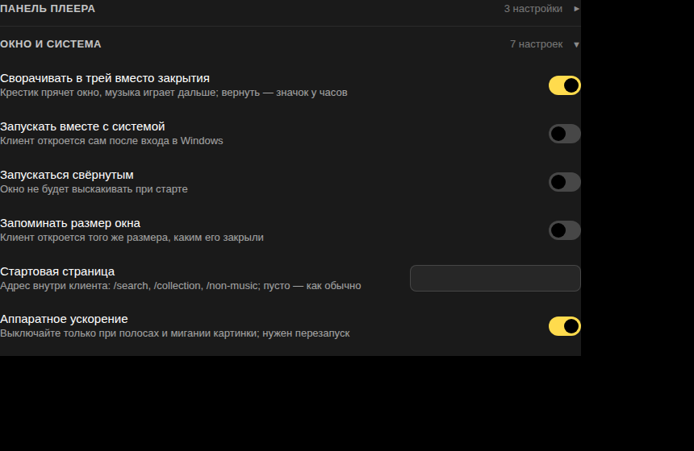

- **Сворачивать в трей вместо закрытия** — крестик прячет окно, музыка
  играет дальше. Вернуть окно можно значком у часов.
- **Запускать вместе с системой** и **запускаться свёрнутым**.
- **Запоминать размер окна** — клиент откроется таким, каким его закрыли.
- **Стартовая страница** — например, сразу «Коллекция» или «Поиск».
- **Аппаратное ускорение** — выключается, если картинка мигает или идёт
  полосами.
- **Управлять этим компьютером с других устройств** — телефон и колонка
  смогут переключать музыку здесь.

</details>

### Горячие клавиши

<details>
<summary>Какие есть и как задать</summary>

Работают поверх других окон — из игры, браузера, откуда угодно.

| Действие | Действие |
| --- | --- |
| Пауза и воспроизведение | Лайк |
| Следующий трек | Повтор |
| Предыдущий трек | Перемешать |
| Громче / тише | Показать мини-плеер |
| Снять фиксацию мини-плеера | |

Сочетания по умолчанию не заданы: выберите удобные вам, чтобы не ловить
совпадения с чужими программами. Нажмите поле и задайте сочетание,
`Backspace` убирает клавишу, «Вернуть по умолчанию» очищает весь набор.
Занятое другой программой сочетание мод подсвечивает красным — иначе
казалось бы, что клавиша не работает по его вине.

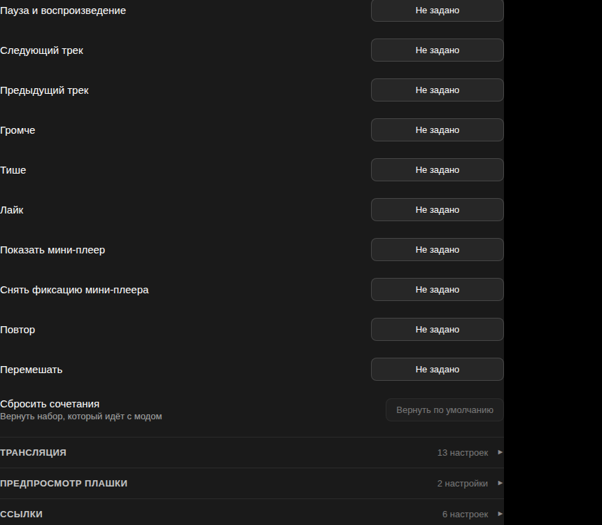

</details>

### Панель плеера и мелочи клиента

<details>
<summary>Список</summary>

- **Время трека всегда на виду** — обычно оно появляется только при
  наведении
- **Без перекраски под обложку** — панель остаётся тёмной
- **Полоса времени толще** — по ней же перематывают, в неё проще попасть
- **Статичная заставка вместо анимации Моей Волны** — для слабых машин:
  клиент умеет так сам при просадке кадров, мод даёт включить это сразу
- **Кнопки на панели задач Windows** — управление из миниатюры окна,
  не разворачивая клиент
- **Процент громкости** — подсказка рядом с ползунком при изменении, и
  свой шаг для колеса мыши
- **Компьютер виден в синхронизации Яндекса** — клиент по умолчанию
  объявляет себя как «только проигрыватель», мод снимает этот запрет.
  Своего экрана выбора устройств у десктопного клиента нет, переключают
  с телефона
- **Масштаб интерфейса** — от 50 до 200 процентов
- **Не гасить экран во время музыки**

</details>

---

## Настройки

Всё управляется прямо в клиенте: **Настройки → KotaMusic**. Изменения
применяются сразу, перезапуск нужен только там, где об этом написано.

Настроек больше шести десятков, поэтому они разложены по сворачиваемым
разделам — на виду только заголовки с числом настроек внутри.

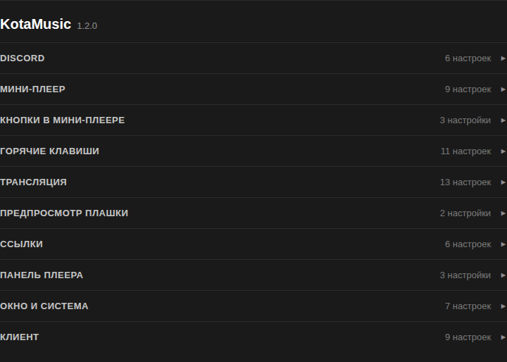

Что именно изменилось в свежей версии, видно в сообщении об обновлении
и целиком — в [CHANGELOG.md](CHANGELOG.md).


---

## Как это устроено

Репозиторий содержит только наш код: слой мода и описания врезок в клиент.
Кода Яндекса здесь нет — сборка скачивает официальный установщик, достаёт
из него `app.asar`, накладывает патчи и пакует обратно.

Сборки выходят автоматически: раз в час проверяется версия клиента,
и на новую собирается свежий мод. Если врезка не легла — сборка падает,
заводится задача, а сломанный релиз не публикуется.

<details>
<summary>Собрать самому</summary>

```bash
npm install
node scripts/build.js --platform=win32   # win32 | linux | darwin
```

Результат — `dist/app.asar` и `dist/build-info.json` с версией клиента
и отчётом по врезкам. Для распаковки установщиков нужны `ar` и `tar`
на Linux, `7z` для Windows и macOS.

Установить собранное в клиент:

```bash
node scripts/install-local.js --client="/путь/к/клиенту"
node scripts/install-local.js --client="/путь/к/клиенту" --restore
```

</details>

<details>
<summary>Структура</summary>

```
mod/        код мода, попадает в app.asar отдельной папкой
patches/    врезки в код клиента; каждая сообщает, что не применилась
scripts/    сборка и работа с официальной раздачей клиента
installer/  установщик с окном
docs/       план работ и картинки
```

</details>

---

## Что дальше

Планы и то, что уже сделано — в [docs/ROADMAP.md](docs/ROADMAP.md).
Нашли ошибку или хотите функцию — [заведите задачу](https://github.com/AveHarrisan/KotaMusic/issues).

## Вопросы и общение

Сервер в Discord — **[discord.com/invite/XYBvdvfv8t](https://discord.com/invite/XYBvdvfv8t)**.
Там же можно рассказать об ошибке, если не хочется заводить задачу.

Где меня ещё найти:

- **[lvl.su](https://lvl.su/)** — сайт: гайды и вики по играм
- **[Котамарин](https://t.me/kotamarine)** — телеграм-канал про игры
- **[AveHarrisan](https://t.me/aveharrisan)** — личный телеграм

Те же ссылки есть внутри мода — в настройках, раздел «Ссылки», — и в окне
установщика.

Мод продолжает идею закрытого проекта **YandexMusicModClient**: тот же круг
возможностей, но своя реализация и автоматические сборки под свежие версии
клиента.

## Поддержать

Ссылки — [в начале страницы](#поддержать-и-найти-меня): **Boosty** для разовой
или регулярной поддержки и **DonationAlerts** для разового доната. Кнопка
«Sponsor» в правой колонке репозитория ведёт туда же.
